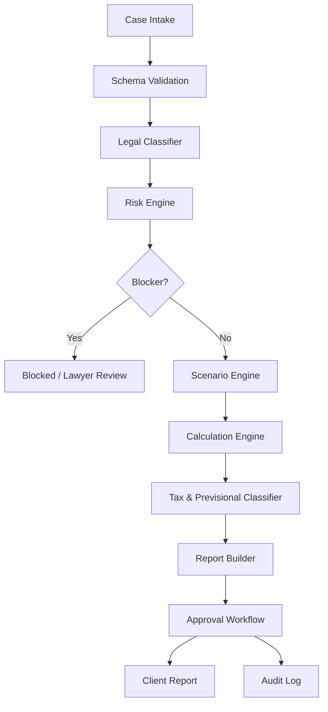

# Architecture

## High-level flow

## Services

### CaseIntakeService

Validates and normalizes case input.

Responsibilities:

- Validate required fields.
- Normalize dates.
- Normalize money fields to CLP integers.
- Attach document metadata.
- Store initial audit entry.

### LegalClassifierService

Determines legal route.

Responsibilities:

- Identify regime: private, public, municipal, honorarios, special.
- Identify contract type.
- Validate termination cause.
- Determine whether ordinary finiquito engine applies.
- Route to special module if public/honorarios/fuero/licencia.

### RiskEngine

Detects blockers and warnings.

Hard blockers:

- Fuero without authorization/desafuero.
- Medical leave + article 161/desahucio path.
- Unpaid cotizaciones.
- Public-sector case incorrectly routed to private engine.
- Honorarios case with high recharacterization risk.
- Invalid resignation risk above threshold.

Warnings:

- Disciplinary termination without evidence.
- Article 161 without business evidence.
- AFC employer offset attempted.
- Deductions without support.
- Bonuses without policy/devengo support.
- Reimbursements without receipts.

### ScenarioEngine

Generates:

1. Employer intended case.
2. Employee challenge case.
3. Worst credible judicial case.

Each scenario has:

- Scenario id.
- Legal assumptions.
- Calculation inputs.
- Enabled/disabled claims.
- Risk score.
- Calculation result.

### CalculationEngine

Computes:

- Service time.
- Indemnizable years.
- Base art. 172.
- IAS.
- Notice indemnity.
- Obra/faena indemnity.
- Feriado.
- Taxable remuneration.
- Worker cotizaciones.
- IUSC.
- Non-taxable payments.
- Reimbursements.
- Deductions.
- Employer-side contributions.
- Net payable.
- Employer cash cost.

Shared logic is in `src/core/` (`tax-engine`, `vacation-engine`, `benefits-engine`). `calculation-engine.ts` orchestrates private-sector scenarios.

### ComplexCaseEngine (Fix3 Complex)

Used for executive and batch termination modes. Orchestrates:

- `ipc-adjustment-engine` — IPC-adjusted 24-month remuneration average
- `art17-n13-engine` — Art. 17 N°13 non-taxable limit and taxable excess
- `iusc-reliquidation-engine` — monthly IUSC allocation on severance excess
- `deduction-evidence-engine` — mutuos/advances with evidence gate
- `complex-indemnity-engine` — contractual days/year, uplift, anniversary warning
- `batch-employee-engine` — per-employee results, consolidated totals, scenario deltas

Entry points:

- `POST /api/complex-cases`
- `POST /api/complex-cases/:id/calculate`

Models: `src/models/complex-case.ts`. See `specs/fix3-complex.md`.

### ReportService

Builds:

- Client summary.
- Line-item table.
- Scenario comparison.
- Risk flags.
- Evidence checklist.
- Appendix with assumptions and sources.

### AuditLogService

Records:

- Input versions.
- Rule version used.
- Calculation trace.
- Overrides.
- Approvals.
- Report version.

