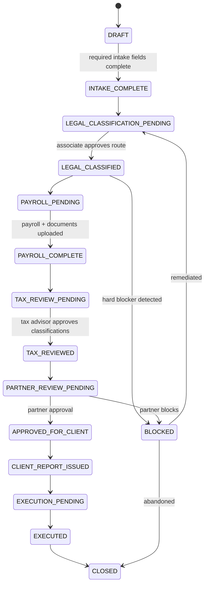

# Workflow and State Machine

## Workflow states

```text
DRAFT
INTAKE_COMPLETE
LEGAL_CLASSIFICATION_PENDING
LEGAL_CLASSIFIED
PAYROLL_PENDING
PAYROLL_COMPLETE
TAX_REVIEW_PENDING
TAX_REVIEWED
PARTNER_REVIEW_PENDING
APPROVED_FOR_CLIENT
CLIENT_REPORT_ISSUED
EXECUTION_PENDING
EXECUTED
CLOSED
BLOCKED
```

## State transitions



## Approval rules

| Condition | Required approval |
|---|---|
| Normal low-risk private case | Associate + tax review |
| Art. 161 needs of business | Associate + partner |
| Article 160 disciplinary | Partner |
| Fuero | Partner; execution blocked absent authorization |
| Medical leave + art. 161 | Partner; execution blocked |
| Honorarios high risk | Partner + litigation review |
| Public-sector case | Public law partner |
| Deductions > 0 | Tax/payroll reviewer |
| AFC employer offset | Partner explicit approval |
| Override of rule treatment | Partner + audit reason |

## Workflow events

```typescript
type WorkflowEvent =
  | "SUBMIT_INTAKE"
  | "CLASSIFY_LEGAL_ROUTE"
  | "UPLOAD_PAYROLL"
  | "RUN_CALCULATION"
  | "REQUEST_TAX_REVIEW"
  | "APPROVE_TAX"
  | "REQUEST_PARTNER_REVIEW"
  | "APPROVE_PARTNER"
  | "BLOCK_CASE"
  | "ISSUE_REPORT"
  | "MARK_EXECUTED"
  | "CLOSE_CASE";
```

## Blocker handling

Blockers must:

- Prevent `APPROVED_FOR_CLIENT`.
- Prevent `EXECUTION_PENDING`.
- Appear in report as “not executable.”
- Require remediation or partner override where legally permissible.

